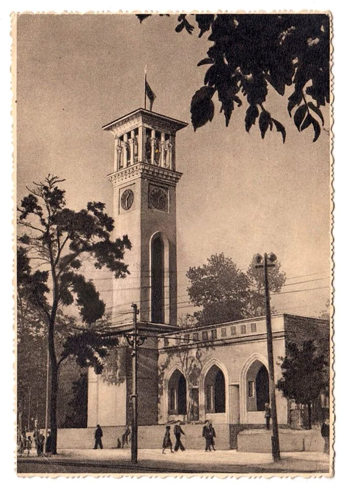

# Assignment 1 - Germany

Background & Expectations: 

    I love history. I think Germany is probably one of the most overstudied and overnalayzed pieces of land in history because they weree separated before, lived under polarly opposite regimes and is not one country again - it is difficult to find such phenomenon in real life. I have seen a lot of maps made about Germany with border of East and West Germany overlaid and that show the difference between the countries, so I thought it would be interesting to make one of those maps myself. 

    At first, I did not have any expectations from the dataset. I thought it would mainly have natural resources, because Lebanon dataset had a lot of natural resources, namely Wadis or rivers. Most of the dataset comes from the public resources provided by different local and countrywide government organizations (a lot of sources in [this page][https://www.geonames.org/datasources] contained the word "bundes" which I think means federal), as well as open datasets (Berlin Open Data, etc.).  

    Dataset has 220,225 data rowss, and 19 columns. From my observation very few amount of changes come from 1994, with majority of changes happening between 2013-2026. 2019, 2021 and 2025 are some of the years that appear more often than the others, but this is just a visual observation not backed by statistical analysis.

    When it comes to available feature codes, mashallah, contributors made a very good job documenting Germany! I have looked at [meaning of each feature code][https://www.geonames.org/export/codes.html], and Germany dataset probably has all of them to be honest. There were quite a lot of farms, small settlements (PPL - populated place, ADM4 - a subdivision of a third-order administrative division) and hotels.

Computational Insights: 

<iframe
  src="{{ '/assets/A1/DE_fm.html' | relative_url }}"
  width="100%"
  height="600"
  style="border: none;">
</iframe>

I picked 3 features codes, all of them kind of unrelated but very interesting:

1. Abandoned villages in the southeast of East Germany

I was just scrolling through different codes they have and stumbled upon couple of codes about abandoned places of living: abandoned towns, farms, factories, camps. So I started playing around and plotting them on graph. To be honest I was a bit biased and was kind of looking for the code which had disparity between East and West Germany, and the one that stuck out to me was villages.

One possible explanation is mining. East Germany had a lot of coal in general, and the main resource of that area was lignite, or brown coal. Unlike underground mines, these open-pit mines expanded across the surface, which meant that entire villages sometimes stood in their way. As the mines expanded, residents were relocated and their houses, churches, and streets were demolished.

This would be interesting to investigate on the map: how many of the abandoned villages sit near former or existing mines? Their locations alone cannot tell us why they disappeared, but a cluster around mining areas would give us a useful starting point.

2. Factories — their abundance in West Germany

This was another discovery when trying to play around with features that show disparity between East and West Germany.

It goes back partly to WWII. After the war, Germany was divided into occupation zones, and the economies of the East and West developed under very different conditions. In the Soviet occupation zone, machinery and entire industrial facilities were dismantled for reparations and brought to Soviet Union. One of such artefacts, a clock tower, is actually in my hometown - Tashkent, Uzbekistan (see image below). This made the initial recovery much harder for the East. Two images show the clock in 1947 and now.

Over the following decades, East Germany had a centrally planned economy, with production organized around state-owned companies. The East still had substantial industry, so it's not like East never had any factories. The major break came around reunification in 1990, when these companies suddenly had to operate under an economic system driven by money and sales and not central planning. That's when it all collapsed.

Factories faced competition from Western products. And the other soviet countries also started collapsing, therefore companies lost customers in former socialist countries.

This gives us a possible explanation for the factory gap visible in the data. But we would still need to look at other factors, for example whether all factories are recorded in GeoNames dataset before treating the number of map points as a direct measure presence of industry and wellbeing of population.

3. Banks and financial institutions — their absence

 I actually thought of this metric when I was auditing another class - Intro to Entrepreneurship. Professor has mentioned that there was research which proved that even after 35 years, people who live in East Germany believe in banks less and invest less in general, and they tied it to living under anti-capitalist regime. At that time I already settled on working with Germany, so this was an 'aha' moment for me. 
    

    
Sadly GeoNames dataset does not document banks well. There are couple of banks recorded in Stuttgart, one bank in Mannheim, and couple more in other small towns. I assume this was entered by local municipalities of those cities/towns, from which afterwards GeoNames dataset was built.
    
I was a bit saddened by this. However, where one door closed a window for exploration was opened - why are banks not displayed well on this dataset? This dataset is a compilation of different open source and government datasets, so I guess government or volunteers at open source datasets were not particularly interested in collecting data about location of banks.

GeoNames is sort of assemblage of assemblages, since it collects data from virtually all open datasets and puts them in one place. There are rules around how to put data in GeoNames, and therefore there will be some biases, some tradeoffs in the sense that who will be shown more and who will be shown less. So GeoNames is definitely an assemblage. 

Furthermore, this exercises of me narrowing down to 3 features is a further form of data assemblage, where I try to tell a story by twisting and turning the lens I use to show the data through.

When it comes to takeaways I have from this exercise, I would say there is one major skill I learned. The power of visualization. It is incredibly strong when I need to make someone believe in my idea. Images speak much better than words, especially a well designed graph. I think this skill will be useful far beyond the class - in virtually all aspects of my life. The process of data assemblage - the choices we make when creating the dataset - I have not thought of this process from this low-level perspective. But it makes a lot of sense, how our actions at the very beginning of assemblage will stay with us and play role until the very end. 

## Notes on AI usage

- Used AI agent (ChatGPT Codex) to find a way to delineate the border between East and West Germany.

- I was puzzled about concentration of abandoned villages in the East Germany, and researched the reasons of abandonment using ChatGPT.